# 📚 ForoHub - Challenge Alura Latam

## 📋 Descripción del Proyecto
**ForoHub** es una API REST robusta desarrollada en Java con Spring Boot para la gestión de un foro comunitario. El sistema permite a los usuarios autenticados crear tópicos de discusión, interactuar mediante respuestas y gestionar el ciclo de vida de las dudas o sugerencias planteadas.

El proyecto implementa seguridad basada en **JWT (JSON Web Tokens)**, persistencia en **PostgreSQL** y una arquitectura modular que separa claramente las responsabilidades de negocio, presentación y acceso a datos.

## 📋 Metodología de Trabajo

Se utilizó metodología Kanban para la gestión del proyecto.

🗂 Herramienta utilizada:

Trello: https://trello.com/b/9DeAlIsq/foro-hub-challenge-back-end

Columnas empleadas:
- Backlog
- En Desarrollo
- Pausado
- Concluido
  
---

## 🧠 Modelo de Datos - Diagrama ER

## 🛠 Stack Tecnológico
| Tecnología | Versión / Detalle |
| :--- | :--- |
| **Java** | 21 (LTS) |
| **Spring Boot** | 3.5.11 |
| **Spring Security** | Implementación de Seguridad Stateless |
| **Auth0 Java JWT** | 4.5.0 |
| **Spring Data JPA** | Gestión de persistencia |
| **PostgreSQL** | Base de datos relacional |
| **Lombok** | Optimización de código (Boilerplate) |
| **Gradle** | Gestor de dependencias y construcción |

---

## 🏗 Arquitectura del Sistema
El sistema sigue un diseño desacoplado en capas, garantizando escalabilidad y facilidad de mantenimiento:

| Capa | Responsabilidad |
| :--- | :--- |
| **Controller** | Expone los endpoints RESTful y gestiona las peticiones HTTP. |
| **Service** | Contiene la lógica de negocio y validaciones complejas. |
| **Repository** | Interfaz de comunicación con la base de datos mediante JPA. |
| **Domain** | Define las entidades JPA (`UserEntity`, `Topico`, `Respuesta`) y las reglas del modelo. |
| **DTO** | Objetos de transferencia de datos para entrada (Request) y salida (Response). |
| **Infrastructure** | Configuraciones de seguridad, filtros JWT y manejo global de excepciones. |

---
## 🏗 Estructura de Carpetas 

---
## 🔒 Seguridad y Autenticación
La seguridad se maneja de forma **Stateless**. Solo los endpoints de `/auth/login` y `/auth/register` están abiertos al público. El resto de la API requiere un token Bearer válido en el encabezado `Authorization`.

### Ejemplo de Registro de Usuario (JSON)
**POST** `/auth/register`

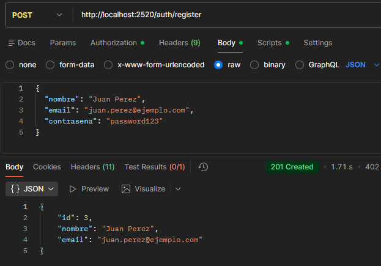

### Login de Usuario
Genera el token JWT necesario para las demás operaciones.

**POST** `/auth/login`
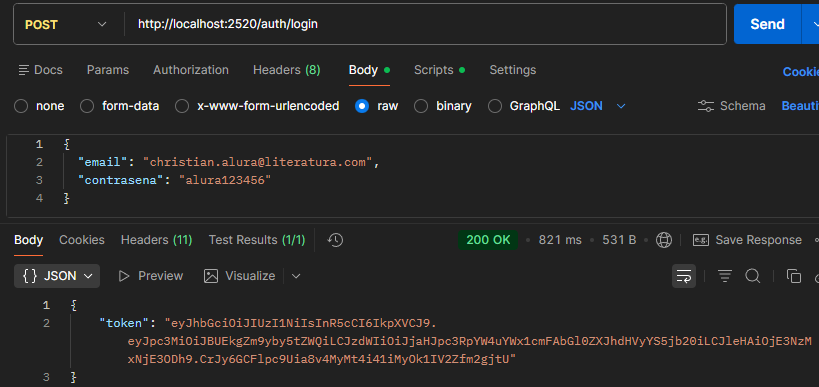

### Crear nuevo Tópico
**POST** `/topico`

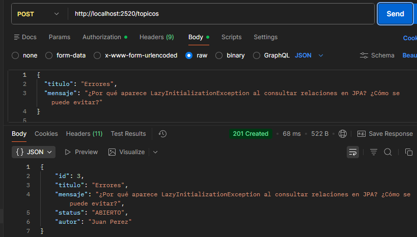

### Ver todos los Tópicos
**GET** `/topico`

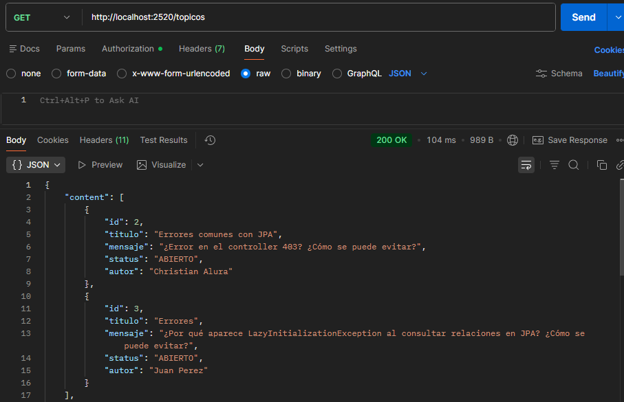

### Ver Tópicos por ID
**GET** `/topico/{id}`

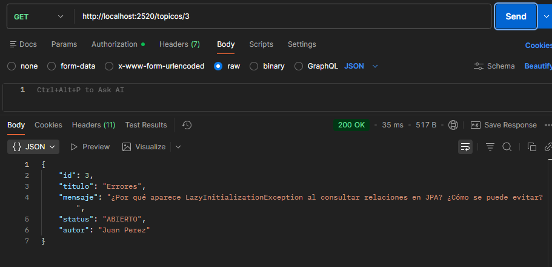

### Eliminar Tópicos por ID
**DELETE** `/topico/{id}`

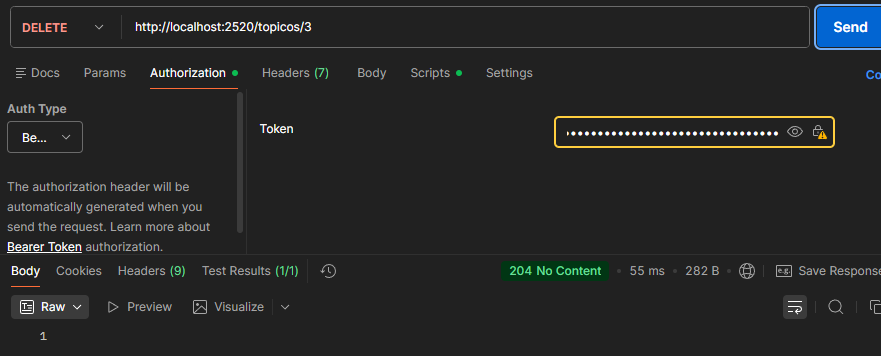

### Actualizar la pregunta del Tópico por ID
**PATCH** `/topico/{id}`

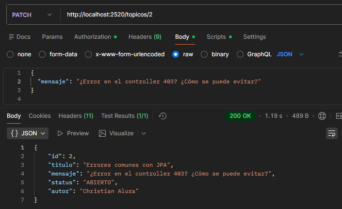

### Crear nueva Respuesta
**POST** `/respuesta`

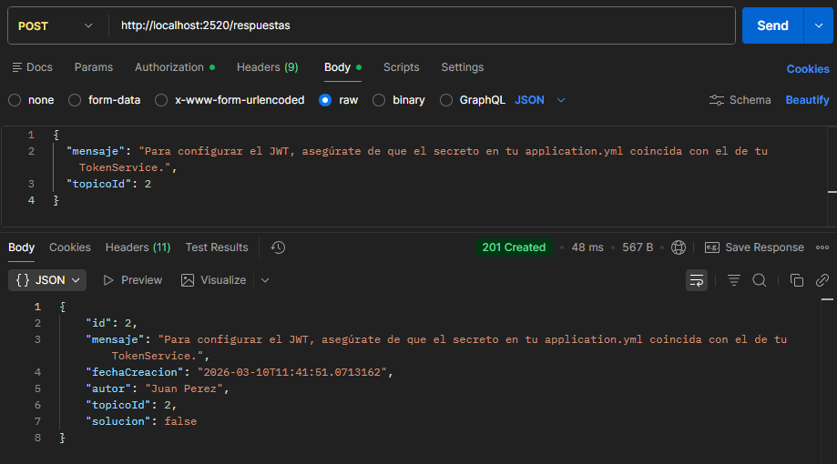

### Ver todas las Respuestas
**GET** `/respuesta`

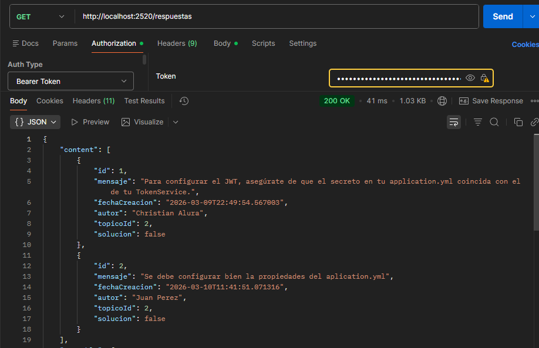

### Ver Respuesta por ID
**GET** `/respuesta/{id}`

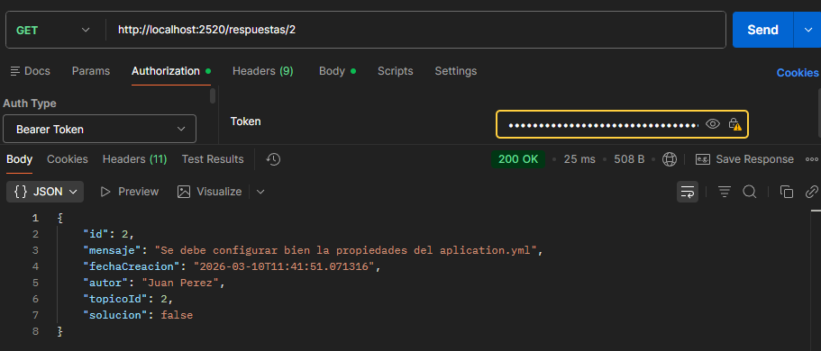

### Eliminar Respuesta por ID
**DELETE** `/respuesta/{id}`

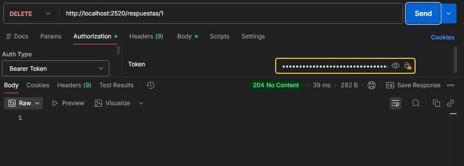

### Actualizar parcialmente la Respuesta por ID
**PATCH** `/respuesta/{id}`

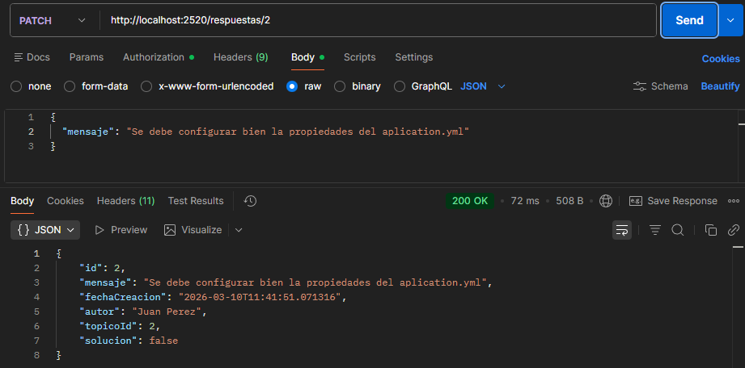
